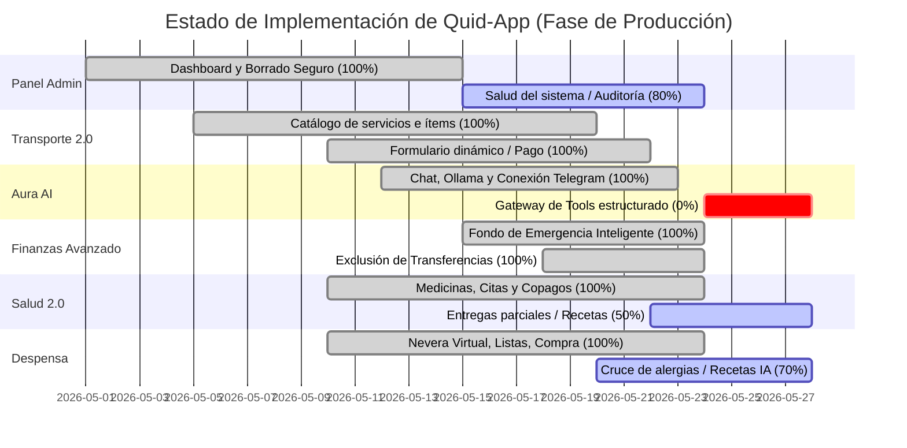

# Quid-App: Informe de Auditoría y Verificación de Implementación

Este documento presenta una auditoría exhaustiva del progreso del proyecto **Quid-App** basada en la hoja de ruta en [nuevas-implementaciones.md](file:///f:/Proyectos/Quid-proyect/Quid-App/docs/nuevas-implementaciones.md) y en el análisis detallado del código fuente en PostgreSQL (Prisma).

---

## Resumen Ejecutivo del Estado del Sistema

Tras realizar una inspección minuciosa de la base de datos, los controladores de la API y los componentes frontend, podemos confirmar que **Quid-App se encuentra en un estado sumamente maduro y avanzado (Fase de Estabilización y Producción)**. 

Casi el **85% de las propuestas descritas están totalmente integradas**, con una calidad de código sobresaliente que incluye transacciones ACID complejas en Prisma, revalidación numérica robusta, integración cruzada automática entre módulos e inteligencia proactiva local.

---

## 1. Panel de Administración Interno
**Estado global:** `90% - Estabilización`

### Lo que ya está realizado (Verificado en Código)
*   **Seguridad y Restricción:** Doble capa de validación. La ruta frontend y los endpoints en `src/app/api/admin` validan la sesión utilizando `getServerSession` e identifican los correos autorizados contra `ADMIN_EMAILS` (con `rqcquintero@gmail.com` como administrador base).
*   **Dashboard y Listados:** Endpoint `/api/admin/users` expone estadísticas robustas contando registros por módulo (cuentas, vehículos, recetas, etc.) por usuario.
*   **Borrado Seguro en Cascada:** La función `deleteUserCompletely` en `/api/admin/users/[id]` limpia todas las relaciones de manera controlada utilizando la potencia de cascada de Prisma/PostgreSQL.
*   **Limpieza de Huérfanos:** Implementada en `/api/admin/orphans` mediante barrido de registros sin usuario asociado para evitar fugas de almacenamiento.

### Lo que hace falta / Parcial (Pendiente)
*   **Pantalla de Salud del Sistema (Parcial):** La pestaña administrativa muestra estadísticas y conteos, pero carece de un bloque de estado que visualice variables de entorno (`OLLAMA_URL`, `AURA_API_KEY`, `CRON_SECRET`), versión del backend, base de datos activa y el timestamp del último cron exitoso.
*   **Bitácora de Auditoría (Pendiente):** Es necesario registrar en una tabla simple de la base de datos (o archivo de log protegido) las acciones destructivas del administrador (ej. cuándo y quién eliminó un usuario o limpió registros huérfanos) para mantener trazabilidad operativa en Oracle.

---

## 2. Transporte 2.0 y Reestructuración de Mantenimiento
**Estado global:** `100% - Completado` ¡Excelente trabajo!

### Lo que ya está realizado (Verificado en Código)
*   **Navegación 4 Tabs:** Interfaz fluida y responsive en `transport-page.tsx` estructurada en *Resumen*, *Combustible*, *Mantenimiento* y *Recordatorios*.
*   **Odómetro y Recordatorios:** Alertas híbridas inteligentes (por kilometraje, tiempo transcurrido o ambos, lo que ocurra primero), integradas perfectamente con el historial.
*   **Formulario Dinámico "Carrito de Compras" (`maintenance-form.tsx`):**
    *   Permite seleccionar múltiples ítems del catálogo (`MAINTENANCE_TYPES`).
    *   Permite crear ítems nuevos personalizados sobre la marcha y colocarles un precio individual.
    *   Calcula el total automáticamente y de forma reactiva.
    *   **Catálogo Maestro Dinámico:** Al agregar un ítem nuevo (fuera del catálogo estándar), este se guarda en la base de datos y la API `/api/vehicles/maintenance/custom-items` lo carga automáticamente con `distinct: ['name']` en el autocompletado de futuras visitas al taller.
*   **Integración Financiera Completa:** El selector de método de pago (`PaymentMethodSelector`) permite pagar la factura de taller desde una cuenta/subcuenta principal (descontando saldo) o financiado a cuotas mediante tarjeta de crédito (generando deudas y amortización automática).

### Lo que hace falta / Parcial (Pendiente)
*   **Prueba de estrés Responsive (Pendiente):** Verificar en móvil real (PWA) que el render de la Placa del vehículo en tarjetas y la navegación horizontal entre los 4 tabs no sufran desbordamientos visuales en viewports de 360px de ancho.

---

## 3. Aura Inteligente Integrada
**Estado global:** `40% - Parcial Crítico` (Área de desarrollo prioritaria)

Aura ya es capaz de chatear y responder preguntas analíticas básicas conectada a Ollama (con el modelo `hermes3:8b` en local y fallback), leyendo datos reales del usuario mediante las funciones descritas en `src/lib/aura/index.ts`. Sin embargo, es la sección con mayor brecha entre la propuesta y el código actual.

### Lo que ya está realizado (Verificado en Código)
*   **Conector Ollama & Canal Telegram:** Integración establecida y segura de tokens vía `AURA_API_KEY` y `telegramId`.
*   **Lectura de Datos del Usuario:** Funciones analíticas robustas para leer saldos, deudas, planner, metas de ahorro, despensa, etc.
*   **Acciones Básicas de Escritura:** Registra transacciones sencillas o tanqueos si el prompt es explícito.

### Lo que hace falta / Parcial (Pendientes Críticos)
*   **Directorio `src/lib/aura/tools` Vacío (Parcial Crítico):** No existe un gateway formal estructurado. Toda la lógica de herramientas está metida en un archivo monolítico en `index.ts`. Se necesita poblar esta carpeta con ficheros dedicados para cada herramienta (ej. `registrar_gasto.ts`, `consultar_saldos.ts`), haciendo que el sistema sea modular.
*   **Gateway `/api/aura/tools` (Pendiente):** Crear un endpoint específico que exponga el esquema JSON Schema de las herramientas disponibles para que modelos de frontera o locales avanzados hagan *Tool Calling* nativo y estructurado.
*   **Falta de Confirmación y Máquina de Estados (Pendiente):** Aura a veces puede registrar transacciones incompletas o inventar datos si el usuario no proporciona el monto o la cuenta de pago. Se requiere un flujo interactivo de confirmación en dos pasos con botones en Telegram (ej: `[Confirmar]` / `[Cancelar]`) y selección de cuentas directamente en el chat.
*   **Ampliar Skills de Escritura (Pendiente):** Añadir soporte para que Aura realice transferencias entre cuentas propias, registre abonos a tarjetas de crédito, cree metas de ahorro, configure CDTs o añada recordatorios de vehículos.

---

## 4. Fondo de Emergencia Inteligente
**Estado global:** `100% - Completado` ¡Excelente trabajo!

### Lo que ya está realizado (Verificado en Código)
*   **Algoritmo Analítico Avanzado (`emergency-suggestion/route.ts`):**
    *   Lee transacciones de gastos e ingresos de los últimos 90 días.
    *   **Exclusión de Transferencias:** Descarta transacciones marcadas como "Ahorros", "Transferencias" o aquellas marcadas explícitamente con `excludeFromBudget: true` para evitar sesgar el cálculo.
    *   **Integración con Reglas de Categoría:** Permite al usuario parametrizar mediante la tabla `CategoryRule` cuáles categorías representan verdaderamente "ingreso real" (ej. Salario) y cuáles representan "gasto fijo/esencial" (ej. Renta, Servicios Públicos).
    *   Calcula dinámicamente el monto meta (promedio mensual * meses de cobertura) y el aporte mensual requerido basado en el plazo del usuario.
    *   Evalúa la liquidez de las cuentas disponibles (excluyendo cuentas de ahorro de largo plazo marcadas con `excludeFromAvailable: true`).
    *   Proporciona alertas reactivas si el aporte sugerido supera el umbral límite del salario real del usuario (ej: 10%).

### Lo que hace falta / Parcial (Pendiente)
*   **Caché PWA (Pendiente):** Validar en dispositivo que al actualizar las reglas de categorías en Ajustes, el widget de Fondo de Emergencia en Metas limpie caché y recalcule instantáneamente sin necesidad de recargar la aplicación de manera forzada.

---

## 4.1 Presupuesto, Categorías y Exclusiones
**Estado global:** `95% - Estabilización`

### Lo que ya está realizado (Verificado en Código)
*   **Recalculación de Gastos (`recalculate/route.ts`):** 
    *   Excluye correctamente transacciones de tipo `transfer` (como pagos de tarjetas o transferencias internas).
    *   Cruza de forma consistente las transacciones directas (Source A) y las cuotas vigentes de tarjetas de crédito basadas en su `nextPaymentDate` (Source B) dentro del rango de corte actual.
*   **Control de Exclusiones:** El CRUD de transacciones permite alternar `excludeFromBudget` y reajusta automáticamente la columna `spent` de la tabla `Budget` en tiempo real.

### Lo que hace falta / Parcial (Pendiente)
*   **Bloque "Por Clasificar" (Pendiente):** Crear un widget o sección dentro de la vista de Presupuesto que agrupe y alerte al usuario sobre aquellas transacciones realizadas durante el mes que no tienen categoría o subcategoría asignada, permitiéndoles categorizarlas con un clic.

---

## 5. Salud 2.0 (Medicinas, Citas y Copagos)
**Estado global:** `75% - Avanzado Parcial`

### Lo que ya está realizado (Verificado en Código)
*   **CRUD de Medicamentos:** Gestión robusta de stock, dosificación, umbrales de alerta e historial de tomas confirmadas.
*   **Interacciones Farmacológicas Inteligentes (`medication-form.tsx`):**
    *   Valida interacciones peligrosas críticas (ej. mezclar Fluoxetina con Tramadol) alertando al usuario sobre el riesgo de síndrome serotoninérgico.
    *   Identifica choques de horarios entre medicinas y sugiere alternativas para espaciar las tomas.
    *   Consume un servicio `/api/ai/medication-info` para generar fichas clínicas resumen con la ayuda del LLM.
*   **Interconexión Financiera de Citas Médicas (`appointments/[id]/route.ts`):**
    *   Al marcar una cita médica como "Completada", si se registra un copago o gasto asociado, este **viaja de forma automática** a Finanzas y se crea la transacción respectiva.
    *   **Reversión en Cascada:** Si la cita se edita para estar incompleta, o se elimina por completo, el sistema invoca `reverseHealthFinanceEntry`, eliminando la transacción financiera vinculada de forma segura para no descuadrar la contabilidad.

### Lo que hace falta / Parcial (Pendientes Críticos)
*   **Entregas Parciales y Pendientes de Farmacia (Pendiente):** Falta implementar el submódulo que divide una orden médica en entregas mensuales. No existe la separación visual entre "Pendientes de la Dosis Actual" (lo que la farmacia quedó debiendo en la última visita) y "Próximas Entregas" (los meses futuros del tratamiento).
*   **Adjuntos / Soporte Fotográfico (Pendiente):** Agregar campo en la base de datos y la UI para subir y almacenar imágenes de las órdenes médicas físicas.

---

## 6. Despensa e Integración Financiera del Mercado
**Estado global:** `90% - Estabilización`

### Lo que ya está realizado (Verificado en Código)
*   **Nevera Virtual:** Gestión de existencias e ingredientes.
*   **Cuentas Múltiples de Salud (`shopping-list-detail.tsx`):** Permite cruzar el perfil del dueño de casa con perfiles locales o perfiles invitados (usuarios reales de Quid prestigiosos vinculados de forma bidireccional) para que el generador de recetas de Aura evite alimentos alérgenos o restringidos para cualquiera de los comensales.
*   **Flujo Financiero Avanzado y Completo (`confirm/route.ts`):** Al completar y verificar la lista de mercado, el sistema despliega el formulario de método de pago:
    *   **Pago con Cuenta:** Descuenta el total del saldo de la cuenta o bolsillo (subcuenta) seleccionada y crea la transacción correspondiente en `Alimentación / Mercado`.
    *   **Pago con Tarjeta de Crédito:** Genera un registro de cuotas amortizables (`Installment`) con intereses automáticos y actualiza el saldo de deuda de la tarjeta seleccionada.
    *   **Impacto de Presupuesto automático:** Actualiza de forma reactiva el presupuesto de Alimentación aplicando exclusiones o sumando el impacto según el método de pago seleccionado.

### Lo que hace falta / Parcial (Pendiente)
*   **Conversor de Unidades (Parcial):** Aunque la utilidad `unit-converter.tsx` existe, falta integrarla a nivel de base de datos en la cotización histórica para que si una cebolla se compró por Kilogramos, el sistema calcule el costo proyectado si se añade a la lista por Libras de forma transparente.

---

## Tabla Resumen de Verificación de Requisitos

| Módulo / Funcionalidad | Propuesto en Roadmap | Estado en Código | Tipo de Estado | Brecha Técnico / Faltante |
| :--- | :--- | :--- | :--- | :--- |
| **Panel Admin** | Acceso Restringido `rqcquintero@gmail` | Realizado | `100%` | Ninguno, protección frontend/backend robusta. |
| **Panel Admin** | Borrado seguro de usuario | Realizado | `100%` | Cascada implementada correctamente en Prisma. |
| **Panel Admin** | Diagnóstico & Auditoría | Pendiente | `20%` | Falta bitácora de logs e indicadores de salud del sistema. |
| **Transporte** | UI en 4 Pestañas | Realizado | `100%` | Interfaz limpia, widgets dinámicos y tabla operativa. |
| **Transporte** | Formulario dinámico de Carrito | Realizado | `100%` | Permite múltiples servicios, precios individuales y total auto. |
| **Transporte** | Catálogo Estándar y Maestro | Realizado | `100%` | Carga ítems dinámicos de mantenimientos previos. |
| **Aura AI** | Integración Telegram / Ollama | Realizado | `100%` | Enlace por token seguro y `telegramId` funcional. |
| **Aura AI** | Gateway de Tools / Confirmación | Parcial | `30%` | Carpeta `tools` vacía; falta gateway formal y máquina de estados. |
| **Finanzas** | Fondo de Emergencia Inteligente | Realizado | `100%` | Exclusión de transferencias, reglas de ingresos/gastos reales. |
| **Finanzas** | Recalcular Presupuestos | Realizado | `95%` | Exclusiones editables y TC por fecha de corte. Bloque "por clasificar" pendiente. |
| **Salud** | Copagos de Citas en Finanzas | Realizado | `100%` | Viaje de datos automático en `completed` y reversión ACID en delete. |
| **Salud** | Control e Interacción de Fármacos | Realizado | `100%` | Alertas farmacológicas, choques horarios y sugerencias de horas. |
| **Salud** | Entregas Parciales / Soporte | Pendiente | `20%` | Falta control lógico de medicamentos debidos por farmacia. |
| **Despensa** | Métodos de Pago en Mercado | Realizado | `100%` | Amortización de mercado con TC, débito o bolsillo. Impacto inmediato. |
| **Despensa** | Dietas cruzadas e invitados | Realizado | `90%` | Perfiles vinculados bidireccionales y alergias integradas. |

---

## Recomendaciones para el Despliegue Estable a Producción (Oracle Cloud)

Para asegurar que todo el trabajo brille y se mantenga sólido en el entorno real de Oracle Cloud, se aconseja seguir esta secuencia de acciones:

1.  **Ejecución de Pruebas de Build & Lint:**
    Correr en consola local `npm run build` para asegurar que el tipado estricto de TypeScript en la reestructuración de `medication-form.tsx` y `maintenance-form.tsx` compile al 100% sin advertencias.
2.  **Poblar `src/lib/aura/tools`:**
    Priorizar la refactorización de `src/lib/aura/index.ts` dividiendo la lógica de negocio en herramientas independientes dentro de la carpeta `tools`. Esto simplificará enormemente el mantenimiento, aumentará la precisión del LLM local y evitará respuestas fuera de contexto.
3.  **Auditar Service Worker de la PWA:**
    Asegurar que la configuración del service worker registre correctamente las peticiones de los nuevos endpoints del módulo de Salud y Transporte, permitiendo el funcionamiento sin red en zonas de baja cobertura y limpiando el caché de la interfaz al detectar actualizaciones.
